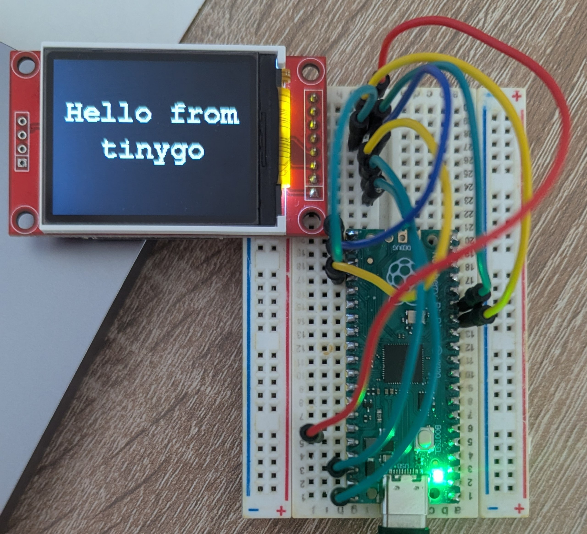

# TinyGo Raspberry Pi Pico Examples

This repository contains example code snippets written
in [TinyGo](https://tinygo.org/docs/reference/microcontrollers/pico/) for
the [Raspberry Pi Pico](https://www.raspberrypi.com/documentation/microcontrollers/pico-series.html) microcontroller
series.

## Prerequisites

- TinyGo compiler. Refer to the [install guide](https://tinygo.org/getting-started/install/)

## Flashing

1. Hold the `BOOTSEL` button on microcontroller.
2. Connect Pi Pico to the machine.
3. When a volume `RPI-RP2` is mounted, run.

```bash
$ cd st7735
$ tinygo flash -target=pico .
```

## Compiling

```bash
$ git clone https://github.com/illiafox/tinygo-pico

$ cd st7735
$ tinygo build -target=pico . # generates st7735.elf file
```

## Available examples

### ST7735 Display



Compatible with ST7735B, ST7735R and ST7735S chips. Uses SPI1 interface and [Freemono](https://github.com/opensourcedesign/fonts/blob/master/gnu-freefont_freemono/README) font.

------------------------------------

| Pi Pico Pin | Display Pin  |
|-------------|--------------|
| VCC         | 5V           |
| GND         | GND          |
| CS          | GP18 (CS)    |
| RESET       | GP17 (RESET) |
| AO          | GP16 (DC)    |
| SDA         | GP11 (MOSI)  |
| SCK         | GP10 (SCLK)  |
| LED         | 3.3V         |

-------------------------------------
See [pinout reference](https://datasheets.raspberrypi.com/pico/Pico-R3-A4-Pinout.pdf)

## Troubleshooting

_**Q: Volume `RPI-RP2` is not mounted**_

_**A**: Try different cable/port_

_**Q: White color on display**_

_**A**: Check whether all things are connected correctly. Pay attention to the SPI pins (SDA/SCK)_


## License

The code is licensed under the **GNU General Public License**, as described in the [`LICENSE`](./LICENSE) file.
